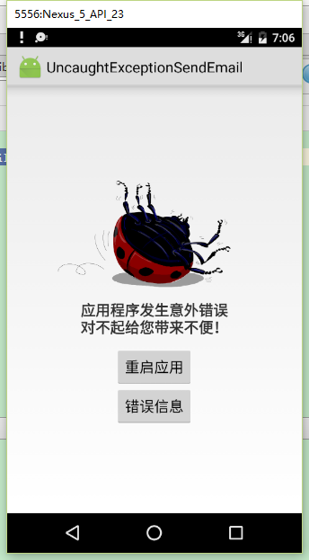
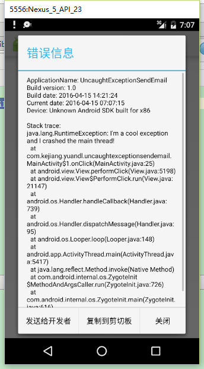

# UncaughtExceptionSendEmail
#Android应用程序未捕获异常并提示用户发送给开发者
#效果图如下

 

#效果图如下
继承系统的application
/**
 * Created by yuandl on 2016/4/7 0007.
 */
public class MyApplication extends Application {
    @Override
    public void onCreate() {
        super.onCreate();
        CustomActivityOnCrash.install(this);
        String[] emialTo = {"13468857714@qq.com"};//配置邮箱
        CustomActivityOnCrash.setEmailTo(emialTo);
        CustomActivityOnCrash.setDebugMode(true);
    }
}

